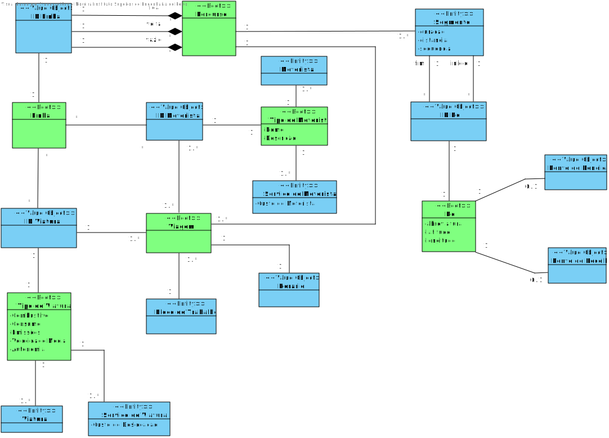

# ISEP-ARQSI-2020/2021

Repositório para o projeto de ARQSI (4 Sprints).

# Projeto Integrador
------------------------------------------------
## Use Cases:
1. Como data administrator, quero importar nós, percursos, linhas, tipos de viatura e tipos de tripulantes de dum ficheiro .glx.
2. Como data administrator, quero criar nós da rede indicando o seu nome, se é ou não uma estação de recolha ou ponto de rendição e as suas coordenadas.
3. Como data administrator, quero criar linha indicando o seu código (ex., “C”), nome (ex., “Linha Verde”) e os seus nós terminais (ex., Campanhã, ISMAI), bem como eventuais restrições sobre o tipo de viatura e tipo de tripulante.
4. Como data administrator, quero definir um percurso de ida/volta de uma linha. Definir os vários segmentos que constituem um percurso indicando a ordem e a distância e tempo de viagem de cada segmento.
5. Como data administrator, quero criar tipo de tripulante, ex., “motorista sénior com conhecimento de línguas estrangeiras”. Um tipo de tripulante é uma descrição livre (não catalogada) de características. 
6.	Como data administrator, quero criar tipo de viatura (ex., “minibus a gasóleo”), indicando o seu tipo de combustível (i.e., Diesel, Gasolina, Elétrico, GPL, Gás), autonomia, custo por quilómetro, consumo médio e velocidade média.  
7.	Como data administrator, quero listar nós de rede. O utilizador deve poder ordenar por código/nome e filtrar por código/nome (ex., todos os nós cujo nome começa por “Par”) os resultados. 
8.	Como data administrator, quero listar linhas. O utilizador deve poder ordenar por código/nome e filtrar os resultados por código/nome (ex., todos as linhas cujo nome começa por “Par”). 
9.	Como data administrator, quero listar percursos duma linha. 
10.	Como data administrator, quero importar viagens, serviços de viatura, blocos de trabalho e serviços de tripulante de dum ficheiro .glx. 
11.	Como data administrator, quero definir viatura. 
12.	Como data administrator, quero definir tripulante (nome, data de nascimento, número de carta de condução, data de validade de licença de condução) associando um ou mais tipos de tripulante. 
13.	Como data administrator, quero criar viagem ad hoc para uma dada linha indicando a hora de saída e o percurso. 
14.	Como data admnistrator quero criar as viagens para uma linha dando a hora de início, a frequência e o número de viagens, o percurso de ida e o de volta.
15.	Como data administrator quero criar um serviço de viatura ad hoc.
16.	Como data administrator quero criar um serviço de tripulante ad hoc.
17.	Como data administrator, quero criar os blocos de trabalho de um serviço de viatura com base na duração de cada bloco e número de blocos máximos e consecutivos. 
18.	Como data administrator ou cliente quero listar as viagens de uma linha.
19.  Como data administrator, quero listar serviço de viatura num determinado dia.
20.  Como data administrator, quero listar serviço de tripulante num determinado dia.

---------------------------

## Views (Níveis 1, 2, 3)

- [Views](#views)
	- **Nível 1**
		- [Vista Lógica](./Semester_Project/Wiki/diagramas/Design/Level_1/vistaLogicaN1.md)
		- [Vista Física](./Semester_Project/Wiki/diagramas/Design/Level_1/VF_1.md)
        - [Vista de Implementação](./Semester_Project/Wiki/diagramas/Design/Level_1/VI.md)
		- **Vista de Processos**
			- [UC1](./Semester_Project/Wiki/diagramas/Design/Level_1/UC1.md)
			- [UC2](./Semester_Project/Wiki/diagramas/Design/Level_1/UC2.md)
			- [UC3](./Semester_Project/Wiki/diagramas/Design/Level_1/UC3.md)
			- [UC4](./Semester_Project/Wiki/diagramas/Design/Level_1/UC4.md)
			- [UC5](./Semester_Project/Wiki/diagramas/Design/Level_1/UC5.md)
			- [UC6](./Semester_Project/Wiki/diagramas/Design/Level_1/UC6.md)
			- [UC7](./Semester_Project/Wiki/diagramas/Design/Level_1/UC7.md)
			- [UC8](./Semester_Project/Wiki/diagramas/Design/Level_1/UC8.md)
			- [UC9](./Semester_Project/Wiki/diagramas/Design/Level_1/UC9.md)
			- [UC10](./Semester_Project/Wiki/diagramas/Design/Level_1/UC10.md)
			- [UC11](./Semester_Project/Wiki/diagramas/Design/Level_1/UC11.md)
			- [UC12](./Semester_Project/Wiki/diagramas/Design/Level_1/UC12.md)
			- [UC13](./Semester_Project/Wiki/diagramas/Design/Level_1/UC13.md)
			- [UC14](./Semester_Project/Wiki/diagramas/Design/Level_1/UC14.md)
			- [UC15](./Semester_Project/Wiki/diagramas/Design/Level_1/UC15.md)
			- [UC16](./Semester_Project/Wiki/diagramas/Design/Level_1/UC16.md)
			- [UC17](./Semester_Project/Wiki/diagramas/Design/Level_1/UC17.md)
			- [UC18](./Semester_Project/Wiki/diagramas/Design/Level_1/UC18.md)
			- [UC19](./Semester_Project/Wiki/diagramas/Design/Level_1/UC19.md)
			- [UC20](./Semester_Project/Wiki/diagramas/Design/Level_1/UC20.md)
	- **Nível 2**
		- [Vista Lógica](./Semester_Project/Wiki/diagramas/Design/Level_2/VL.md)
        - [Vista de Implementação](./Semester_Project/Wiki/diagramas/Design/Level_2/VI.md)
		- [Vista Física](./Semester_Project/Wiki/diagramas/Design/Level_2/VF.md)
		- **Vista de Processos**
			- [UC1](./Semester_Project/Wiki/diagramas/Design/Level_2/UC1.md)
			- [UC2](./Semester_Project/Wiki/diagramas/Design/Level_2/UC2.md)
			- [UC3](./Semester_Project/Wiki/diagramas/Design/Level_2/UC3.md)
			- [UC4](./Semester_Project/Wiki/diagramas/Design/Level_2/UC4.md)
			- [UC5](./Semester_Project/Wiki/diagramas/Design/Level_2/UC5.md)
			- [UC6](./Semester_Project/Wiki/diagramas/Design/Level_2/UC6.md)
			- [UC7](./Semester_Project/Wiki/diagramas/Design/Level_2/UC7.md)
			- [UC8](./Semester_Project/Wiki/diagramas/Design/Level_2/UC8.md)
			- [UC9](./Semester_Project/Wiki/diagramas/Design/Level_2/UC9.md)
			- [UC10](./Semester_Project/Wiki/diagramas/Design/Level_2/UC10.md)
			- [UC11](./Semester_Project/Wiki/diagramas/Design/Level_2/UC11.md)
			- [UC12](./Semester_Project/Wiki/diagramas/Design/Level_2/UC12.md)
			- [UC13](./Semester_Project/Wiki/diagramas/Design/Level_2/UC13.md)
			- [UC14](./Semester_Project/Wiki/diagramas/Design/Level_2/UC14.md)
			- [UC15](./Semester_Project/Wiki/diagramas/Design/Level_2/UC15.md)
			- [UC16](./Semester_Project/Wiki/diagramas/Design/Level_2/UC16.md)
			- [UC17](./Semester_Project/Wiki/diagramas/Design/Level_2/UC17.md)
			- [UC18](./Semester_Project/Wiki/diagramas/Design/Level_2/UC18.md)
			- [UC19](./Semester_Project/Wiki/diagramas/Design/Level_2/UC19.md)
			- [UC20](./Semester_Project/Wiki/diagramas/Design/Level_2/UC20.md)
		- [Mapeamento Vista Física-Implementação](./Semester_Project/Wiki/diagramas/Design/Level_2/VI_F.md)
		- [Mapeamento Vista Lógica-Implementação](./Semester_Project/Wiki/diagramas/Design/Level_2/VL_I.md)
	- **Nível 3**
		- [Vista Lógica](./Semester_Project/Wiki/diagramas/Design/Level_3/VL.md)
		- [Vista de Implementação](./Semester_Project/Wiki/diagramas/Design/Level_3/VI.md)
		- [Vista Física](./Semester_Project/Wiki/diagramas/Design/Level_3/VF.md)
		- **Vista de Processos**
			- [UC1](./Semester_Project/Wiki/diagramas/Design/Level_3/UC1.md)
			- [UC2](./Semester_Project/Wiki/diagramas/Design/Level_3/UC2.md)
			- [UC3](./Semester_Project/Wiki/diagramas/Design/Level_3/UC3.md)
			- [UC4](./Semester_Project/Wiki/diagramas/Design/Level_3/UC4.md)
			- [UC5](./Semester_Project/Wiki/diagramas/Design/Level_3/UC5.md)
			- [UC6](./Semester_Project/Wiki/diagramas/Design/Level_3/UC6.md)
			- [UC7](./Semester_Project/Wiki/diagramas/Design/Level_3/UC7.md)
			- [UC8](./Semester_Project/Wiki/diagramas/Design/Level_3/UC8.md)
			- [UC9](./Semester_Project/Wiki/diagramas/Design/Level_3/UC9.md)
			- [UC10](./Semester_Project/Wiki/diagramas/Design/Level_3/UC10.md)
			- [UC11](./Semester_Project/Wiki/diagramas/Design/Level_3/UC11.md)
			- [UC12](./Semester_Project/Wiki/diagramas/Design/Level_3/UC12.md)
			- [UC13](./Semester_Project/Wiki/diagramas/Design/Level_3/UC13.md)
			- [UC14](./Semester_Project/Wiki/diagramas/Design/Level_3/UC14.md)
			- [UC15](./Semester_Project/Wiki/diagramas/Design/Level_3/UC15.md)
			- [UC16](./Semester_Project/Wiki/diagramas/Design/Level_3/UC16.md)
			- [UC17](./Semester_Project/Wiki/diagramas/Design/Level_3/UC17.md)
			- [UC18](./Semester_Project/Wiki/diagramas/Design/Level_3/UC18.md)
			- [UC19](./Semester_Project/Wiki/diagramas/Design/Level_3/UC19.md)
			- [UC20](./Semester_Project/Wiki/diagramas/Design/Level_3/UC20.md)

--------------------------------------------------------

# Views

Será adotada a combinação de dois modelos de representação arquitetural: C4 e 4+1.

O Modelo de Vistas 4+1 [[Krutchen-1995]](References.md#Kruchten-1995) propõe a descrição do sistema através de vistas complementares permitindo assim analisar separadamente os requisitos dos vários stakeholders do software, tais como utilizadores, administradores de sistemas, project managers, arquitetos e programadores. As vistas são deste modo definidas da seguinte forma:

- Vista lógica: relativa aos aspetos do software visando responder aos desafios do negócio;
- Vista de processos: relativa ao fluxo de processos ou interações no sistema;
- Vista de desenvolvimento: relativa à organização do software no seu ambiente de desenvolvimento;
- Vista física: relativa ao mapeamento dos vários componentes do software em hardware, i.e. onde é executado o software;
- Vista de cenários: relativa à associação de processos de negócio com atores capazes de os espoletar.

O Modelo C4 [[Brown-2020]](References.md#Brown-2020)[[C4-2020]](References.md#C4-2020) defende a descrição do software através de quatro níveis de abstração: sistema, contentor, componente e código. Cada nível adota uma granularidade mais fina que o nível que o antecede, dando assim acesso a mais detalhe de uma parte mais pequena do sistema. Estes níveis podem ser equiparáveis a mapas, e.g. a vista de sistema corresponde ao globo, a vista de contentor corresponde ao mapa de cada continente, a vista de componentes ao mapa de cada país e a vista de código ao mapa de estradas e bairros de cada cidade.
Diferentes níveis permitem contar histórias diferentes a audiências distintas.

Os níveis encontram-se definidos da seguinte forma:
- Nível 1: Descrição (enquadramento) do sistema como um todo;
- Nível 2: Descrição de contentores do sistema;
- Nível 3: Descrição de componentes dos contentores;
- Nível 4: Descrição do código ou partes mais pequenas dos componentes (e como tal, não será abordado neste DAS/SAD).

Pode-se dizer que estes dois modelos se expandem ao longo de eixos distintos, sendo que o Modelo C4 apresenta o sistema com diferentes níveis de detalhe e o Modelo de Vista 4+1 apresenta o sistema de diferentes perspetivas. Ao combinar os dois modelos torna-se possível representar o sistema de diversas perspetivas, cada uma com vários níveis de detalhe.

Para modelar/representar visualmente, tanto o que foi implementado como as ideias e alternativas consideradas, recorre-se à Unified Modeling Language (UML) [[UML-2020]](References.md#UML-2020) [[UMLDiagrams-2020]](References.md#UMLDiagrams-2020).

-------------------------------------------------

### Modelo de Domínio

------------------------------------------------

# Architecture Background

Foi utilizada uma arquitetura baseada em Onion, visto que é a mais fácil de *aumentar* no futuro, à medida que o sistema evolua ou haja a necessidade para tal.

Esta arquitetura foi aplicada nos módulos MDR e MDV. Na SPA foi usada uma **CBA - Component Based Architecture**, uma arquitetura pioneira do Facebook, que essencialmente usa uma interface controladora para encapsular componentes individuais, e torná-los em essencialmente micro-sistemas. Para entender em detalhe esta arquitetura, é possível consultar: ["Understanding Component-Based Architecture"](https://medium.com/@dan.shapiro1210/understanding-component-based-architecture-3ff48ec0c238).
  
## Problem Background

### System Overview

A Autoridade Intermunicipal de Transportes (AIT) pretende um sistema de gestão e planeamento de transportes públicos que permite a gestão, bem como a consulta pelo público em geral de diferentes redes de transportes, linhas, viagens, bem como o planeamento dos serviços de viaturas e motoristas a efetuar nessas linhas.

### Context

O planeamento de transportes aborda diversas otimizações e afetações de recursos humanos e materiais com vista a cumprir o serviço de transporte pretendido bem como maximizar determinados parâmetros do operador com vista à sua eficiência operacional e financeira.
Genericamente, a oferta de transportes de um operador é o conjunto das viagens oferecidas por cada uma das suas linhas ao longo dos percursos da rede que tem mais interesse em termos de mobilidade de pessoas na área geográfica em que atua.

### Quality attributes

Os atributos de qualidade são categorizados e sistematizados segundo o modelo [FURPS+](https://pt.wikipedia.org/wiki/FURPS).

#### **Funcionalidade**
1. Cada sistema só poderá aceder aos dados que lhe dizem respeito.
2. Deve ser auditada e verificada a integridade da informação a que os sistemas acedem.
3. Com vista à necessidade de saber e necessidade de conhecer, toda a informação deve estar protegida de acessos indevidos. Ou seja, o princípio de minimização de acesso ao que é essencial para cada utilizador/aplicação, criação de túneis para transferência de informação, avaliação da integridade de dados e aplicações, e encriptação/minimização dos dados.
4. Uma vez que o módulo de gestão de encomendas se encontra virado para o exterior, é necessário ter especial atenção com a privacidade e proteção de dados à luz do RGPD. Assim é necessário que o sistema cumpra a legislação em vigor e, em especial, disponibilize as informações legais e informe o utilizador aquando do seu registo, bem como permita aceder e cancelar a sua conta nos casos e nas condições legalmente permitidas.

#### **Usabilidade**
5. A SPA deve permitir acesso a todos os módulos do sistema: master data, planeamento e visualização, bem como RGPD.
6.  No âmbito do projeto atual, a administração de utilizadores pode ser efetuada diretamente na base de dados não sendo necessário um módulo de gestão de utilizadores.

#### **Confiabilidade (Reliability)**
7. O sistema deve estar operacional 24 horas por dia, isto é, o tempo de paragem deve ser nulo, salvo algum problema ou perda dos serviços externos ao sistema, como é o caso das bases de dados (MongoDB, Azure Server).
8. A estimativa de tempo, no qual o sistema deve estar operacional, é decisão do cliente. O sistema está preparado para existir perpetuamente.

#### **Desempenho (Performance)**
9. Os módulos MDR e MDV têm um tempo de resposta quase instantâneo. O MDR pode ter uma performance um pouco mais lenta na leitura de ficheiros e criação dos objetos de interesse ao negócio na base de dados, mas este tempo a mais deve-se à metodologia do servidor Azure.
10. A SPA tem um tempo de resposta bastante reduzido também, e a mudança entre componentes é também instantânea.
11. A SPA tem uma performance mais baixa no que toca à visualização 2D e 3D do mapa, dado que o mesmo, e todas as funcionalidades associadas ao mesmo, são obtidas a partir duma API externa: [Mapbox](https://docs.mapbox.com/mapbox-gl-js/api/).

#### **Suportabilidade**
12. Embora não esteja no âmbito atual do projeto, deve ser levado em conta na arquitetura da solução, a extensão futura para aplicações móveis.

--------------------

### **Design Constraints**
1. O sistema deve ser composto por uma aplicação web do tipo **Single Page Application** (SPA) que permite aos utilizadores autorizados acederem aos diferentes módulos da aplicação, bem como por um conjunto de serviços que implementem as componentes de regras de negócio necessárias para o funcionamento da aplicação web.

### **Implementation constraints**
1. Todos os módulos devem fazer parte do código fonte da mesma SPA e serem disponibilizados como um único artefacto.

### **Interface constraints**
1.   A SPA deve permitir acesso a todos os módulos do sistema: master data rede, master data viagem, planeamento e visualização, bem como RGPD.
2.   O módulo de Planeamento deve consumir dados de rede através da API do master data
3.   O módulo de Planeamento deve consumir dados de viagens através da API do master data
4.   O módulo de Visualização deve consumir dados de rede através da API do master data
5.   O módulo de Visualização deve consumir dados de viagens através da API do master data "viagens"
6.   O módulo de Visualização deve consumir dados de serviços de tripulante através da API do planeamento

### **Physical constraints**
1.  Existem dois servidores em load balancing, onde estão instaladas as aplicações, serviços e as bases de dados e que se encarregam do armazenamento da informação.
2.  Existem ainda dois servidores em failover que distribuem os endereços a todos os sistemas e se encarregam da autenticação de sistemas e utilizadores (DHCP, DNS (se aplicável) e autenticação de servidores, e eventualmente um servidor Kerberos).
3.  Algumas das aplicações devem ser implementadas *on premises* e outras em IaaS e PaaS (*on cloud*). O MDR e a SPA encontram-se implementados on premises, nos servidores do DEI. E todas se encontram implementadas em cloud. MDR e SPA utilizam [Heroku](https://www.heroku.com/), e MDV e Planeamento utilizam [Azure Virtual Machines](https://azure.microsoft.com/pt-pt/services/virtual-machines/).

------------------

### **Principais Funcionalidades**

De um modo geral, as principais funcionalidades de cada módulo são as seguintes:

- Master Data – permite a gestão da informação relacionada com a rede (nós, percursos), tipos de viaturas, tipos de tripulantes, linhas e viagens.
- UI – interface com o utilizador.

No âmbito do projeto atual, a administração de utilizadores pode ser efetuada diretamente na base de dados não sendo necessário um módulo de gestão de utilizadores.

-------------------

## Solution Background

### **Architectural Approaches**

Baseado nos requisitos não funcionais e restrições de design, serão adotadas as seguintes abordagens/padrões/estilos:

- Client-Server, porque cada um dos "módulos" MDR, MDV, Planeamento são aplicações servidoras de outras aplicações clientes;
- Web Application, em que o frontend é desempenhado por uma SPA (Single Page Application), e que o backend é desempenhado pelos módulos MDR, MDV e Planeamento;
- SOA, porque os servidores (cf. anterior) deverão disponibilizar APIs, e particularmente APIs para serem usadas na web, disponibilizando serviços para os clientes respetivos. Serão adotados os nível 0, 1 e 2 do [Modelo de Maturidade de Richardson](https://martinfowler.com/articles/richardsonMaturityModel.html) aplicado a REST;
- N-Tier, pois as várias aplicações devem ser implantadas em diferentes máquinas *on premises* e IaaS e PaaS (*on cloud*), de acordo com os requisitos não funcionais;
- Layered architecture, mais especificamente Onion Architecture, por razões académicas.
- Component-based-architecture, usada na SPA.

Outras abordagens/estilos/padrões, como por exemplo a interligação entre aplicações baseado em mensagens-eventos foram desconsideradas para não violar os requisitos e restrições definidos, mas também por questões académicas.

### **Analysis Results**
Não existem por agora resultados de análise ou avaliação. Estudos qualitativos acerca dos estilos/padrões adotados (nomeadamente Onion em MDR e MDV, mas também Dependency Injection na UI), permitem empiricamente advogar que a manutenibilidade, evolutabilidade e testabilidade do software são elevadas, ao mesmo tempo que permitem atingir as funcionalidades desejadas.

----------------

# Glossary and Acronyms

* **DDD** - Domain Driver Design
* **DTO** - Data Transfer Object
* **MDR** - Master Data Rede
* **MDV** - Master Data Viagem
* **API** - Application Programming Interface
* **Ad Hoc** - When necessary or needed

-------------